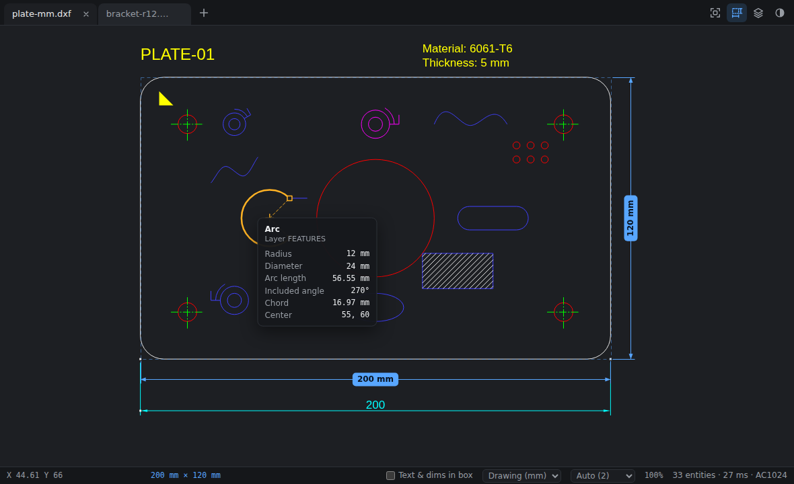

# DXF Viewer

A lightweight, fast-starting desktop viewer for DXF drawings.



- **Overall dimensions on the bounding box.** Width and height dimension lines are drawn on the drawing's axis-aligned ("cardinal") bounding box. They follow the view and stick to the window edge when you zoom in.
- **Hover to measure.** Point at a line, arc, circle, polyline segment, ellipse or spline to see its measurements:
  - Lines: length, angle, ΔX and ΔY.
  - Arcs: radius, diameter, arc length, included angle, chord and centre.
  - Circles: radius, diameter, circumference, area and centre.
  - Polylines: the hovered segment plus the whole polyline's perimeter and area.
- **One window per file, tabs on demand.** Each opened file gets its own window. Drag a window's tab onto another window's tab bar to merge it in as a tab. Drag a tab out of a tab bar to tear it off into its own window again.
- **Small and quick.** It is built with [Tauri](https://tauri.app) and uses the operating system's web view, not a bundled browser. The UI is plain TypeScript and Canvas 2D (about 20 KB gzipped, plus a 50 KB parser worker). DXF files are parsed off the UI thread. Typical drawings open in well under a second, and a 40 MB file with 230,000 entities in a couple of seconds. Pan and zoom stay fluid on huge drawings.

## Using it

| Action | How |
| --- | --- |
| Open files (each in a new window) | <kbd>Ctrl/⌘ O</kbd>, the **+** button, double-click a `.dxf` file, or `dxf-viewer a.dxf b.dxf` |
| Open files as tabs of this window | Drop them from the file manager onto the window |
| Merge a window into another | Drag its tab onto the other window's tab bar |
| Tear a tab off | Drag it down out of the tab bar (or right-click the tab › *Move to new window*) |
| Merge every window into this one | Right-click a tab › *Merge all windows here* |
| Reorder tabs | Drag along the tab bar |
| Measure | Hover a line or arc |
| Zoom / pan | Mouse wheel or pinch / drag with the left or middle button, or the arrow keys |
| Fit drawing | <kbd>F</kbd>, <kbd>Home</kbd> or double-click |
| Toggle dimension lines | <kbd>D</kbd> |
| Layers panel | <kbd>L</kbd> |
| Close tab / next tab | <kbd>Ctrl/⌘ W</kbd> / <kbd>Ctrl Tab</kbd> |
| Cancel a tab drag | <kbd>Esc</kbd> |

The status bar shows the cursor position, the bounding-box size, units and precision, and zoom. Units come from `$INSUNITS` and can be converted between mm, cm, m, in and ft. The number of decimals defaults to the drawing's `$LUPREC`. By default the box measures geometry only; tick **Text & dims in box** to include text, dimensions and leaders. Layers that are hidden in the layers panel are left out of the box.

## Supported DXF

The files can be ASCII or binary DXF, from R12 to 2018. Pre-2007 files are decoded using their `$DWGCODEPAGE`.

The viewer draws these entities: LINE, ARC, CIRCLE, ELLIPSE, LWPOLYLINE and POLYLINE (2D/3D, with bulges; polyface and polygon meshes as wireframe), SPLINE (NURBS, or fit points only), POINT, TEXT, MTEXT, ATTRIB, INSERT (nested blocks, MINSERT arrays, mirroring), DIMENSION and ACAD_TABLE (via their blocks), HATCH (solid fills and clipped pattern lines), SOLID, TRACE, 3DFACE, LEADER, RAY and XLINE.

It resolves layers (on/off/frozen), colours (ACI, true colour, BYLAYER/BYBLOCK), linetypes and object coordinate systems (extrusion). Model space is shown.

Not drawn: images, wipeouts, MLINE and MULTILEADER, and ACIS solids. The status-bar tooltip lists anything that was skipped. Fonts are approximated with a sans-serif system font.

## Building

Prerequisites:

- Node.js 20 or newer.
- A stable Rust toolchain.
- The [Tauri system dependencies](https://tauri.app/start/prerequisites/). On Debian/Ubuntu that means `libwebkit2gtk-4.1-dev build-essential libssl-dev libxdo-dev librsvg2-dev`. On Windows you need WebView2, which ships with Windows 10 and 11. macOS needs nothing extra.

```sh
cd dxf-viewer
npm ci
npm run tauri dev            # desktop app with hot reload
npm run tauri build          # installers in src-tauri/target/release/bundle/
```

The same UI also runs in a browser as a single-window build: `npm run dev` and open http://localhost:1420. Add `?open=samples/plate-mm.dxf` to open a file directly. In the browser, files open as tabs of the page; native windows are desktop-only.

**Linux and Wayland.** Moving tabs between windows needs global window and cursor positions, and Wayland does not provide them. The app therefore runs under XWayland when `WAYLAND_DISPLAY` is set, unless you set `GDK_BACKEND` yourself.

## Tests

```sh
npm test                     # parser, geometry and measurement unit tests (Vitest)
npm run test:e2e             # browser end-to-end tests (Playwright)
scripts/desktop-smoke.sh     # Linux: real windows under Xvfb, dragging tabs between them with xdotool
```

The desktop smoke test checks four things:

- Opening two files gives two windows.
- Dragging one window's tab onto the other merges them.
- Dragging a tab out of the tab bar tears it off into a new window.
- A second launch hands its file to the running instance.

It needs `Xvfb openbox xdotool imagemagick x11-utils dbus`. Run it with a binary from `npx tauri build --debug --no-bundle`, or with a plain `cargo build` while `npm run dev` is running.

`scripts/make_samples.py` regenerates the sample drawings with [ezdxf](https://ezdxf.mozman.at/). This is a development-only dependency.

## How it works

```
src/dxf/        streaming tag reader (ASCII + binary, code pages) and entity parser
src/geom/       flattening to 2D: blocks, OCS, bulges, NURBS, hatch clipping, extents, measurements
src/worker/     parse + flatten in a Web Worker; results are transferred as typed arrays
src/view/       Canvas renderer (Path2D batches), dimension overlay, hover picking (Flatbush index)
src/ui/         tabs, layers panel, status bar, settings
src/host/       window management: Tauri (desktop) or single-page (browser)
src-tauri/      Rust: windows per file, document registry, cross-window tab dragging, single instance
```

Tab dragging between windows is done natively, not with HTML drag and drop, so it does not depend on each web engine's drag-and-drop quirks:

1. The page that owns the tab keeps the pointer captured and reports each move.
2. The Rust side reads the global cursor position and moves the dragged window, either the tab's own single-tab window or a new window for a tab pulled out of a tab bar.
3. When the cursor is over another window's tab bar, the dragged window parks just below that bar. The target shows where the tab will land; releasing the mouse hands the document over along with its pan and zoom.

## Open-source components

| Component | Purpose | Licence |
| --- | --- | --- |
| [Tauri](https://github.com/tauri-apps/tauri), tauri-plugin-dialog, tauri-plugin-single-instance | Desktop shell, windows, file dialog, single instance | MIT / Apache-2.0 |
| [Flatbush](https://github.com/mourner/flatbush) | Static R-tree for hover picking | ISC |
| [Vite](https://vite.dev), [TypeScript](https://www.typescriptlang.org) | Build | MIT / Apache-2.0 |
| [Vitest](https://vitest.dev), [Playwright](https://playwright.dev) | Tests | MIT / Apache-2.0 |
| [ezdxf](https://github.com/mozman/ezdxf) | Generating sample drawings (dev only) | MIT |

The DXF parser, geometry code and renderer are written for this project.
